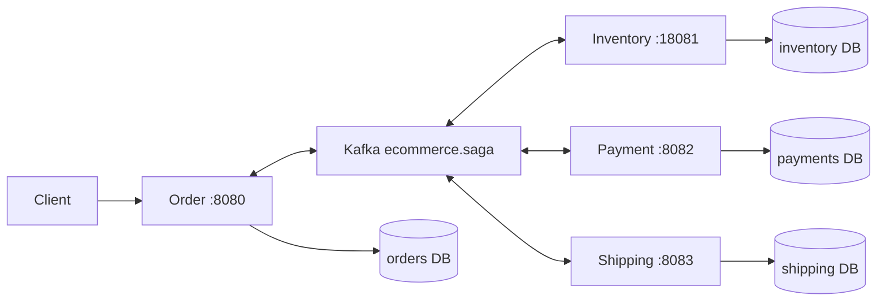
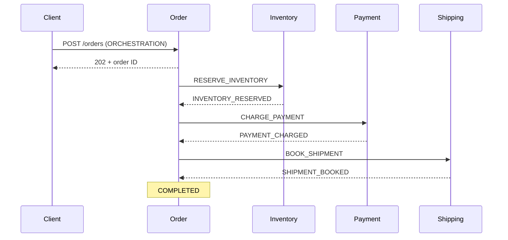
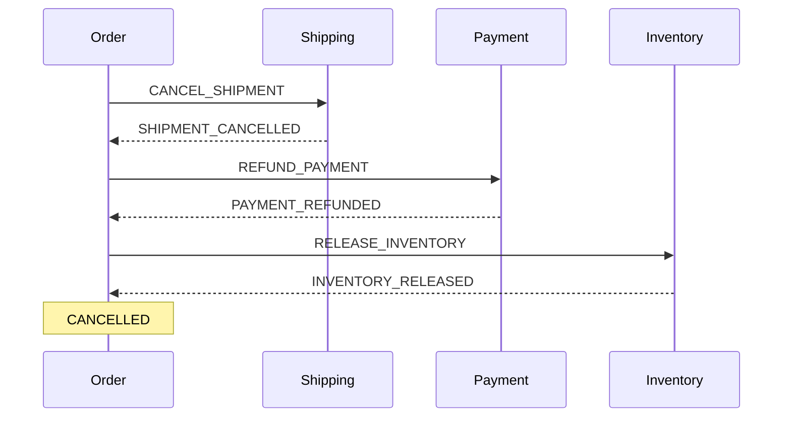
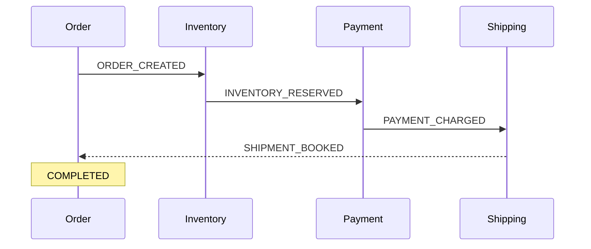

# Detailed saga guide

## 1. What this POC teaches

A checkout changes multiple independently owned databases. A local transaction cannot
atomically reserve stock in one service and charge a payment in another. A saga is a
sequence of local transactions with compensating transactions when checkout cannot finish.
Compensation is a new business action, not an SQL rollback across services.

The single-item order has only `sku`, `quantity`, `amountCents`, `mode` and an optional
demo `fault`. `amountCents` is a supplied total in one assumed currency, not a calculated
catalog price. A production checkout would validate prices on the server. Customer,
address, product description and card fields would distract from the transaction concept.

Inventory seeds `SKU-1` with 100 units and `SOLD-OUT` with zero. Payment and shipping
are deterministic simulated providers stored in their respective databases.

## 2. Architecture and data ownership



For local efficiency, the databases share one PostgreSQL server. They use different
owners and logins, and public cross-database CONNECT privileges are revoked. No
service queries another service's tables. In production they can move independently.

The common module contains technical messaging contracts only; it does not contain
shared business entities or a database shared by services. Every database receives its
own `inbox`, `outbox`, quarantine and demo fault tables through Flyway.

One topic is sufficient to make the flow inspectable. Each service has a separate
consumer group, so it sees every record and filters for relevant commands/events.
Messages use `sagaId` as Kafka key; there are three partitions. Separate command/event
topics with ACLs and an external schema registry are sensible production extensions.

## 3. Orchestration



All arrows between services are asynchronous Kafka messages, published via outboxes.
Order persists `RESERVING -> PAYING -> SHIPPING -> COMPLETED` and emits the next
command only after the expected success event. Duplicate/stale success events do not
advance an unrelated stage.

On a business rejection, client cancellation or deadline expiry:



This protocol compensates all participants, including ones that never performed their
forward step. Such a compensation writes a cancellation marker and acknowledges a no-op.
It is essential when a command was sent but its result is unknown.

The state sequence is `CANCELLING_SHIPPING -> REFUNDING -> RELEASING -> CANCELLED`.
Waiting for compensation acknowledgements makes incomplete recovery visible.

## 4. Choreography



Inventory reacts to `ORDER_CREATED`, Payment to `INVENTORY_RESERVED`, and Shipping
to `PAYMENT_CHARGED`. Order observes completion; it does not issue forward commands.

On rejection or timeout, Order broadcasts `CANCEL_SAGA`. Each participant independently
compensates and publishes its acknowledgement. Order remains `COMPENSATING` until
all three distinct acknowledgements arrive. A bit mask prevents repeated refund events
from being mistaken for acknowledgements from three different participants.

This is **choreographed forward execution with a coordinated abort/watchdog**.
It deliberately does not claim to solve global timeout detection without any coordination.
Parallel compensation differs from reverse sequential compensation; decide whether that
is valid for the actual business. In this simulated domain, refunds and stock release
can proceed independently after cancellation has been decided.

| Concern | Orchestration | Choreography |
|---|---|---|
| Next-step decision | Persisted Order state machine | Participant's event subscription |
| Forward commands | Explicit | No central forward commands |
| Compensation | Reverse sequential | Broadcast, parallel |
| Global progress | Directly visible in coordinator | Reconstructed from events |
| Adding a step | Change coordinator and participant | Change event chain and abort acknowledgements |
| Main operational cost | Coordinator availability and ownership | Understanding distributed dependencies |

## 5. Transaction and delivery guarantees

### Incoming message transaction

1. Deserialize and validate envelope version, fields and `Kafka key == sagaId`.
2. Ignore records irrelevant to this service.
3. Insert `message_id` into the inbox using `ON CONFLICT DO NOTHING`.
4. Acquire a transaction-scoped advisory lock derived from saga ID.
5. Apply the local business action and append outgoing events to the outbox.
6. Commit the database transaction. Only then may the listener acknowledge the record.

Any exception rolls back the inbox insertion, business changes and outgoing messages.
Kafka can redeliver the original record. Advisory locks serialize different event IDs for
the same saga, including a compensation arriving before its forward command.

### Outbox relay

The relay reads pending records in sequence order. A PostgreSQL advisory lock allows
only one relay per service database at a time, even with multiple service replicas.
It sends records and waits for Kafka acknowledgement before recording `sent_at`.
The transaction holds only messaging locks; provider operations do not run inside it.
The bounded batch of 20 and a 5-second send wait keep this simple and inspectable.
On broker errors it keeps rows pending and backs off from 1 to 30 seconds.

If the process dies after Kafka accepts a message but before PostgreSQL commits
`sent_at`, the relay sends it again. Therefore delivery is **at least once**.
Kafka producer idempotence alone cannot close the database/Kafka atomicity gap.

The polling relay intentionally trades throughput for obvious ordering. Higher-volume
systems may use CDC/Debezium or a leased per-aggregate relay. Do not add independent
relay workers that allow one saga's later message to overtake an earlier one.

### Two kinds of idempotency

- **Transport:** inbox uniqueness prevents repeating a committed message ID.
- **Business:** participant state keyed by saga ID prevents repeated reserve/charge/
  booking, even when a replay has a new message ID. Compensation is idempotent too.

HTTP `Idempotency-Key` has a unique database constraint. The same key and same body
returns the existing order. The same key with a changed body returns `409 Conflict`.
Concurrent requests cannot create two orders with the same key.

### Cancellation markers and late results

Suppose Payment receives `REFUND_PAYMENT` before a delayed `CHARGE_PAYMENT`.
A refund with no charge is recorded as a permanent refunded state. The late charge
sees that state and cannot charge. Similarly released inventory cannot be re-reserved,
and cancelled shipping cannot be rebooked. Keep those markers and inbox entries at
least as long as any record can be replayed. Deleting them too early breaks the guarantee.

Order ignores late success after entering compensation or a terminal state. A timeout
means the result is unknown, not proof that the participant did nothing.

### Isolation limits

Stock uses an atomic conditional update requiring enough available units. Separate
sagas contend on the product row without taking stock negative. PostgreSQL CHECK
constraints provide an additional boundary. This is local concurrency control, not
global ACID isolation. Other systems can observe reserved stock or charged payment
before the saga completes. Real businesses must decide which intermediate states are
visible, which actions are reversible and where the point of no return lies.

## 6. Scenario matrix

Run `node scripts/scenarios.mjs` for executable assertions. `--quick` omits long
deadline/recovery exercises. Each mode supports the same request fields.

| Scenario | Request/trigger | Expected result |
|---|---|---|
| Success | `SKU-1`, `fault=NONE` | COMPLETED; RESERVED, CHARGED, BOOKED |
| No stock | `sku=SOLD-OUT` | CANCELLED; no net charge or stock change |
| Unknown SKU | A valid but unseeded SKU | Inventory rejects; saga compensates |
| Payment decline | `PAYMENT_DECLINED` | CANCELLED; reservation released |
| Shipping rejection | `SHIPPING_REJECTED` | CANCELLED; refund and stock release |
| Duplicate HTTP | Same Idempotency-Key and body | Same order ID, one business effect |
| Key conflict | Same key, changed quantity/amount | HTTP 409 |
| Invalid input | Quantity 0, missing mode, invalid SKU | HTTP 400 before order creation |
| Transient payment error | `PAYMENT_TRANSIENT` | First attempt fails, retry succeeds |
| Payment unavailable | `PAYMENT_UNAVAILABLE` | Quarantine; deadline triggers compensation |
| Refund unavailable | `REFUND_UNAVAILABLE` | Shipping rejects; compensation requires intervention |
| Operator recovery | Unblock Payment then retry order | Compensation completes; CANCELLED |
| Late forward command | Publish after cancellation | Cancellation marker prevents new effect |
| Duplicate event | Publish identical message ID twice | One committed handling |
| Stock contention | Concurrent orders exceeding remaining stock | Some reject; stock never negative |
| Broker outage | Stop Kafka after accepting requests | Outbox retained; resumes on restart |
| Service restart | Restart Order mid-saga | Persisted deadline/state resumes |
| Poison envelope | Publish invalid version directly to Kafka | Durable failure record and service DLT |

Faults are enabled only with `DEMO_ENABLED=true`. The supplied Compose enables them
and `/ops`; the application default is false. Transient fault counters use their own
transaction so a business rollback cannot reset the attempt counter forever.

## 7. Failed compensation and operator recovery

Create a `REFUND_UNAVAILABLE` order. Shipping rejects after Payment has charged.
Refund processing retries twice after the initial attempt, then moves the failed
record to durable quarantine. The compensation deadline eventually produces
`MANUAL_INTERVENTION`. Stock may remain reserved in orchestration because the reverse
sequence is waiting for the refund. In choreography, inventory can already be released.

PowerShell recovery (replace the ID):

```powershell
$id = 'REPLACE-WITH-ORDER-ID'
$headers = @{'X-Demo-Token'='local-demo-token'}
Invoke-RestMethod http://localhost:8082/ops/failures -Headers $headers
Invoke-RestMethod "http://localhost:8082/ops/unblock/$id" -Method Post -Headers $headers
Invoke-RestMethod "http://localhost:8080/orders/$id/retry" -Method Post
Invoke-RestMethod "http://localhost:8080/orders/$id"
```

`retry` starts compensation again with new message IDs. Already compensated participants
acknowledge without repeating effects. It never restarts a checkout or retries a charge.

To redeliver a particular quarantined record after fixing its cause:

```powershell
$failureId = 1
Invoke-RestMethod "http://localhost:8082/ops/replay/$failureId" -Method Post -Headers $headers
```

Replay retains the original message ID; a rolled-back inbox entry does not block it.
Each quarantine row can be replayed once; a failure on replay creates another failure
record with its new Kafka offset. Replaying bad JSON does not fix bad JSON. Correct
the producer/contract, and decide whether to discard or publish a corrected record.
Replaying a late charge after cancellation remains safe because of participant markers.

Consumer offset recovery happens only after quarantine and a DLT outbox record commit.
If quarantine storage is down, recovery fails and Kafka retains the record for retry.

## 8. API reference

| Method and path | Purpose |
|---|---|
| POST `:8080/orders` | Create checkout; requires Idempotency-Key, returns 202 |
| GET `:8080/orders/{id}` | Current order state and reason |
| GET `:8080/orders/{id}/history` | Persisted state transitions |
| POST `:8080/orders/{id}/cancel` | Cancel an active order; completed checkout returns 409 |
| POST `:8080/orders/{id}/retry` | Retry incomplete compensation; other states return 409 |
| GET `:18081/inventory/stock/{sku}` | Available stock |
| GET `:18081/inventory/{id}` | Reservation or release marker |
| GET `:8082/payments/{id}` | Charge/refund record |
| GET `:8083/shipments/{id}` | Booking/cancellation record |
| GET `:port/actuator/health` | Service health |
| GET `:port/actuator/prometheus` | JVM, HTTP, datasource and client metrics |
| GET `:port/ops/failures` | Last 100 quarantine rows, newest first |
| GET `:port/ops/outbox` | Pending and total outbox counts |
| POST `:port/ops/unblock/{id}` | Disable injected failures for this saga in this service |
| POST `:port/ops/replay/{failureId}` | Replay one quarantined record |
| POST `:port/ops/publish` | Publish a validated envelope for duplicate/late-message exercises |

All `/ops` routes require `X-Demo-Token` and exist only in demo mode. Override the
local token with `DEMO_TOKEN` when sharing a development machine. These controls are
for local failure demonstrations; the business APIs do not implement authentication.

Envelope example for `/ops/publish`:

```json
{
  "version": 1,
  "id": "b7a8eed4-a23a-40d3-9213-500e500358ee",
  "sagaId": "2ef0c343-8662-41b4-bfdc-7991456d8a2c",
  "mode": "ORCHESTRATION",
  "type": "CHARGE_PAYMENT",
  "sku": "SKU-1",
  "quantity": 1,
  "amountCents": 1200,
  "fault": "NONE"
}
```

Use a real saga ID and its original payload for an existing checkout. Conflicting
payloads are rejected. IDs are UUIDs; SKU is 1–40 uppercase letters, digits or hyphens;
quantity is 1–1000; amount is 1–1,000,000,000 minor units. `fault` defaults to `NONE`.

## 9. Running services from an IDE

Start only infrastructure:

```sh
docker compose up -d --wait postgres kafka
```

Set Java 26 as the Gradle JVM and import `settings.gradle`. Use each application's
main class as a separate run configuration. Set these environment variables:

| Module | DB_URL | DB_USER / DB_PASSWORD | Default HTTP port |
|---|---|---|---|
| order-service | jdbc:postgresql://localhost:55432/orders | orders / orders | 8080 |
| inventory-service | jdbc:postgresql://localhost:55432/inventory | inventory / inventory | 18081 |
| payment-service | jdbc:postgresql://localhost:55432/payments | payments / payments | 8082 |
| shipping-service | jdbc:postgresql://localhost:55432/shipping | shipping / shipping | 8083 |

Also set `KAFKA_BOOTSTRAP_SERVERS=localhost:9092` and `DEMO_ENABLED=true` for the
scenario runner. `SERVER_PORT` can override a port. Do not run IDE processes and
Compose service containers on the same published ports simultaneously.

PowerShell example in a new terminal for Order:

```powershell
$env:DB_URL='jdbc:postgresql://localhost:55432/orders'
$env:DB_USER='orders'
$env:DB_PASSWORD='orders'
$env:DEMO_ENABLED='true'
.\gradlew.bat :order-service:bootRun
```

`SAGA_TIMEOUT_SECONDS` is the overall forward-flow deadline, starting at request
acceptance. `COMPENSATION_TIMEOUT_SECONDS` starts when compensation starts or is
explicitly retried. Both default to 30 seconds; the watchdog checks once a second.
Completed state changes commit with their outgoing commands. Expired work is found
after restart by querying the database, not by recreating in-memory timers.

## 10. Inspection and failure exercises

`node scripts/resilience.mjs` automates broker outage, Order restart while Payment is
offline, durable timeout recovery, and invalid-envelope quarantine in both modes.
It restores stopped services in `finally` blocks and verifies actual participant state
and stock. Run it separately from the business scenario suite, since it stops services.
`node scripts/resilience.mjs --poison-only` reruns just the poison/DLT assertion and is
safe with retained DLT history.

```sh
docker compose ps
docker compose logs --tail=100 order-service payment-service
docker compose exec kafka /opt/kafka/bin/kafka-topics.sh --bootstrap-server kafka:19092 --list
docker compose exec kafka /opt/kafka/bin/kafka-consumer-groups.sh --bootstrap-server kafka:19092 --all-groups --describe
docker compose exec postgres psql -U orders -d orders -c "select id,status,reason,deadline from orders order by created_at desc limit 10"
docker compose exec postgres psql -U payments -d payments -c "select id,error,replayed_at from failed_message order by id desc limit 10"
```

For a broker-outage exercise, stop only this project's Kafka, submit an order and
inspect `/ops/outbox` on Order. Its pending count rises. Restart Kafka and wait for
convergence; if the outage exceeded the deadline, cancellation is the expected outcome.

```sh
docker compose stop kafka
# Submit checkout, then inspect Order's outbox.
docker compose start kafka
```

For a restart exercise, stop Payment, submit a checkout, restart Order, and start
Payment again. An order within its deadline can complete; an expired order compensates.
Inspect its history and all participant records. Neither outcome should double-charge
or leave a CANCELLED order with a live booking/reservation/charge.

For malformed input, pipe a line with a valid UUID key and invalid JSON/version to
`kafka-console-producer.sh` using `parse.key=true` and `key.separator=|`. Each service
will quarantine an envelope it cannot validate; inspect its `*-service.DLT` topic and
`/ops/failures`. The demo HTTP publish endpoint intentionally validates envelopes.

## 11. Troubleshooting

- **Port conflict:** inspect the error and change the relevant host-side Compose port;
  update scenario URLs or test database URL to match. Internal database port stays 5432.
- **Docker not available:** start Docker Desktop in Linux-container mode.
- **No stock after many runs:** successful orders consume stock. Reset only this POC's
  volumes intentionally with `docker compose down -v`, then start again.
- **Tables or users missing after editing bootstrap SQL:** initialization runs once on
  an empty PostgreSQL volume. Use Flyway for application schema changes; reset a disposable
  demo volume to rerun database bootstrap.
- **Order stuck:** inspect deadline, history, participant quarantine, consumer lag and
  outbox pending counts before replaying. A failed refund requires fixing the refund cause.
- **New mode unsupported:** allowed mode names are uppercase ORCHESTRATION and CHOREOGRAPHY.
- **Gradle Java mismatch:** set JAVA_HOME to a JDK 26 installation; `./gradlew --version`
  shows the launcher/daemon JVM. No preview or early-access Java build is required.
- **PostgreSQL rejects Asia/Calcutta on Windows:** use `-Duser.timezone=UTC` in IDE or
  direct `java -jar` VM options. Gradle `bootRun` already sets UTC. Some PostgreSQL
  distributions do not ship legacy time-zone aliases reported by the Windows JVM.

## 12. Production considerations and deliberate boundaries

This is a working production-oriented POC, not an internet-ready storefront. It demonstrates
durability and recovery while keeping the deployment small enough to study.

- Real payment APIs need an external idempotency key (usually saga ID plus operation),
  a durable intent, provider outcome reconciliation and handling for an ambiguous timeout.
  A PostgreSQL rollback cannot undo a remote card charge.
- Real shipment dispatch may become irreversible. Model booking vs dispatch separately
  and define a pivot step or a business exception process.
- Add application identity, authorization, Kafka ACLs/TLS, secret management, rate limits,
  network policy and audited operator access before exposing APIs beyond localhost.
- Use replicated Kafka with an appropriate minimum in-sync replica policy and HA PostgreSQL.
  The demo has single-node infrastructure; it does not demonstrate host-failure availability.
- Set SLO-based deadlines and provider-specific retry budgets. The 30-second demo deadlines
  and 1-second consumer retry delay make exercises quick; they are not universal defaults.
- Monitor consumer lag, oldest pending outbox age, quarantine growth, compensation age
  and intervention counts. Exported base metrics and correlation logs are a starting point;
  this POC does not include an alerting platform or distributed trace backend.
- Define retention and archival for history, outbox, inbox, quarantine and cancellation
  markers. Unbounded retention is deliberate for this small demo; deleting deduplication
  state while replay remains possible is unsafe.
- Evolve versioned event schemas with compatibility rules. Unknown versions are rejected.
  A shared Java contract is convenient here; independently deployed organizations need
  stronger schema compatibility governance.
- Reconcile incomplete sagas and provider ledgers, especially after operational mistakes.
  "Exactly once" claims cannot replace business-level consistency checks.
