# Ecommerce Saga — A Visual Walkthrough

A diagram-led explanation of the working [ecommerce saga POC](../README.md).

**Read this first:** an order touches four independent databases. A saga coordinates
local transactions so checkout either finishes or its completed work is compensated.
Compensation is a new business transaction: a refund, a stock release, or a booking
cancellation.

The example throughout is **one unit of SKU-1 for 1,200 minor currency units**.
Payment and shipping are simulated providers in this POC.

> **Viewing:** Open the [browser edition](VISUAL-WALKTHROUGH.html) locally to see all
> diagrams without extensions or internet access. GitHub renders the Mermaid blocks
> in this source document. Read top to bottom for the complete flow.

## 1. The system at a glance

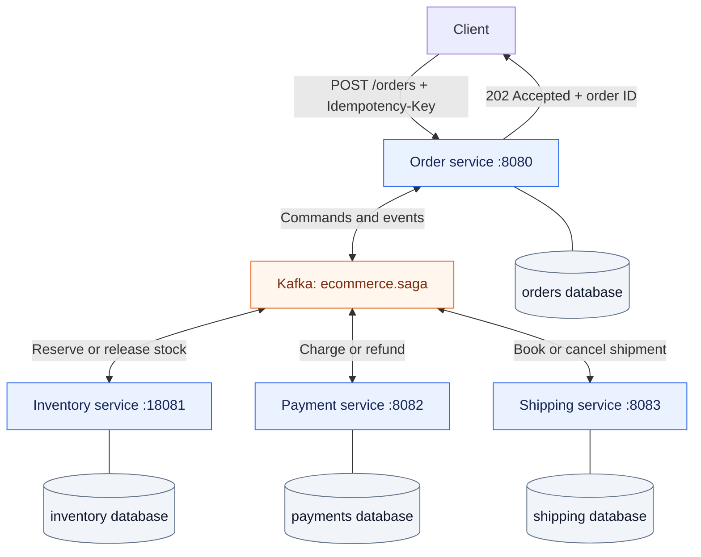

Each service owns its database and login. The local deployment shares a PostgreSQL
server, but services never join or update each other's tables.

**202 means accepted, not completed.** The client polls `GET /orders/{id}` to see
the final result. The order ID is also the saga ID.

### How to read the remaining diagrams

- Inter-service arrows represent **asynchronous Kafka messages**, even when Kafka
  is omitted to keep a diagram readable.
- A **command** asks a service to act: `CHARGE_PAYMENT`.
- An **event** reports an outcome: `PAYMENT_CHARGED`.
- Every outgoing business message is first saved in an **outbox**.
- Self-directed arrows show a local database change.

## 2. Two ways to choose the next step

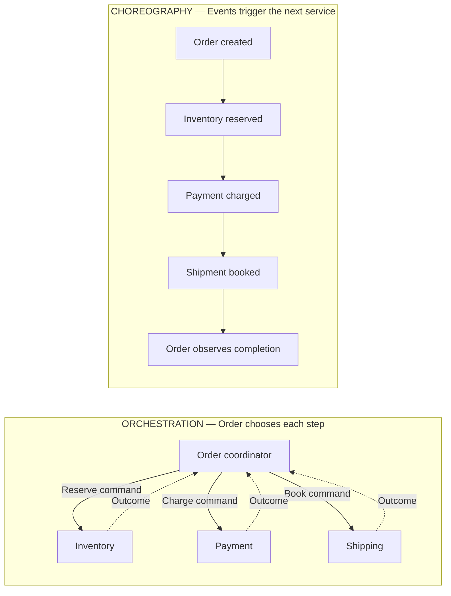

In orchestration, the coordinator sends the next command **after** the preceding
step succeeds. In choreography, each participant subscribes to the previous
participant's success event.

This implementation uses **choreography for forward execution and a coordinated
abort/watchdog for cancellation**. Order still detects timeout and decides when to
broadcast cancellation.

## 3. Orchestration: successful checkout

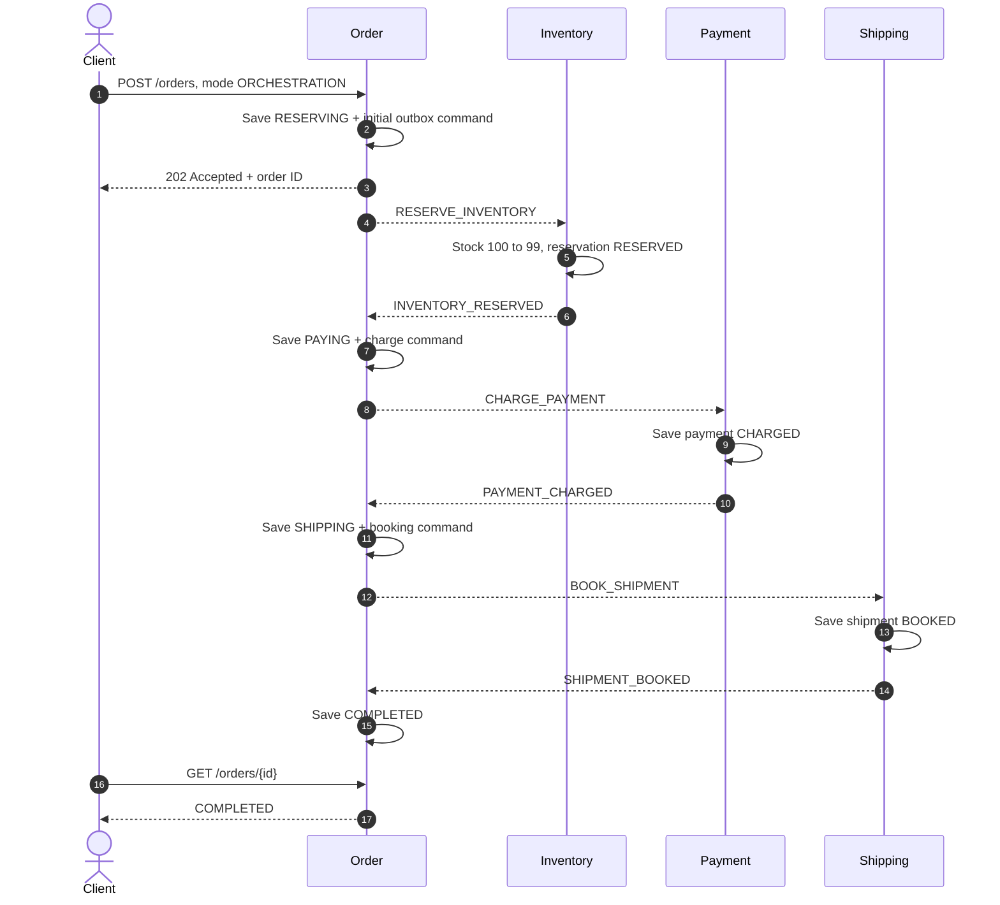

| Service | Final record | Business meaning |
|---|---|---|
| Order | COMPLETED | Checkout finished |
| Inventory | RESERVED | One unit is allocated; available stock is 99 |
| Payment | CHARGED | Simulated payment succeeded |
| Shipping | BOOKED | Simulated shipment booking succeeded |

The POC stops at booking. It does not model warehouse dispatch, delivery, or converting
a reservation into a separate inventory-consumption record.

## 4. Orchestration: shipping fails after payment

Stock is already reserved and Payment is already charged. Shipping rejects the
booking, so Order runs compensation **in reverse order**.

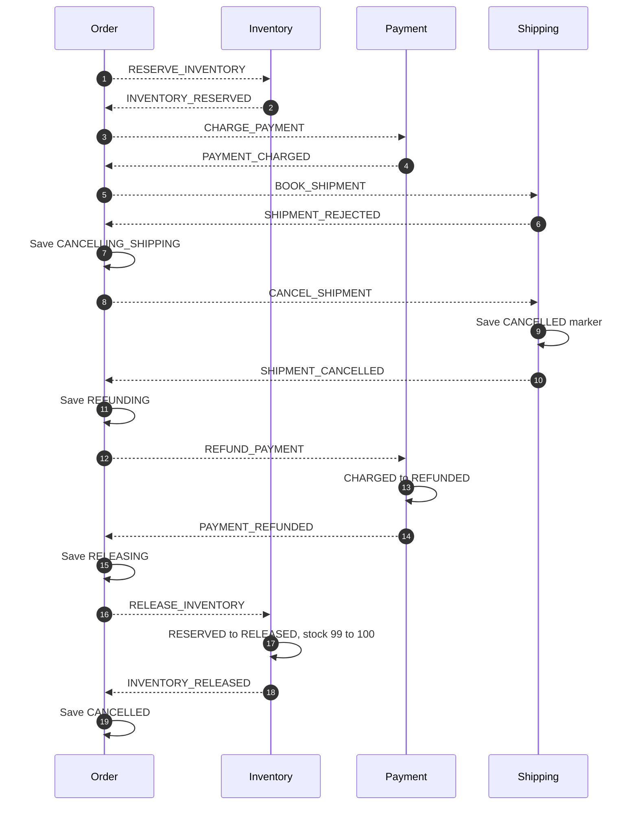

**Why cancel a shipment that was rejected?** The same cancellation protocol handles
a rejected booking, a lost response, and a booking command still in transit. Writing
a cancellation marker makes all three cases safe.

The same reverse sequence is used for inventory rejection, payment rejection, client
cancellation, and forward timeout. Steps that never ran acknowledge a no-op compensation.

## 5. Choreography: successful checkout

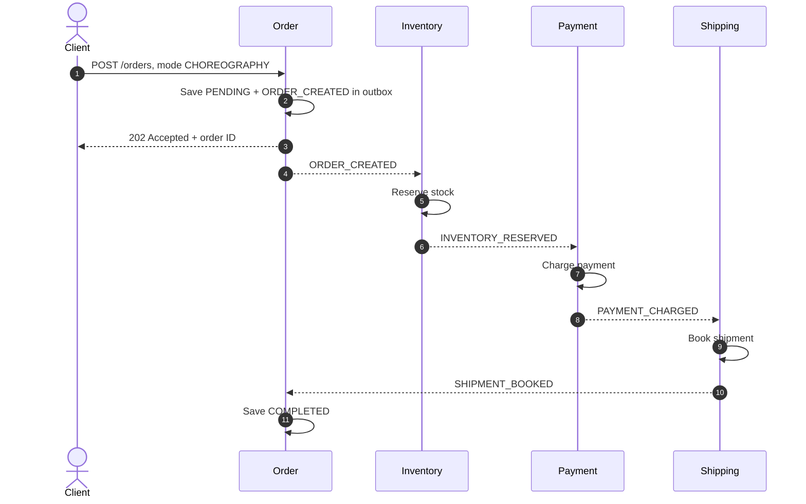

Order does **not** send `CHARGE_PAYMENT` or `BOOK_SHIPMENT` in this mode.
The subscriptions themselves determine the forward sequence.

Kafka broadcasts each record to the separate service consumer groups. The diagram
shows the consumers that drive the next business step; other services may also see
and ignore or observe that record. Order remains `PENDING` until it completes or
starts compensation.

## 6. Choreography: cancellation fans out

A rejection or timeout makes Order publish **one** `CANCEL_SAGA` event. Each
participant compensates independently.

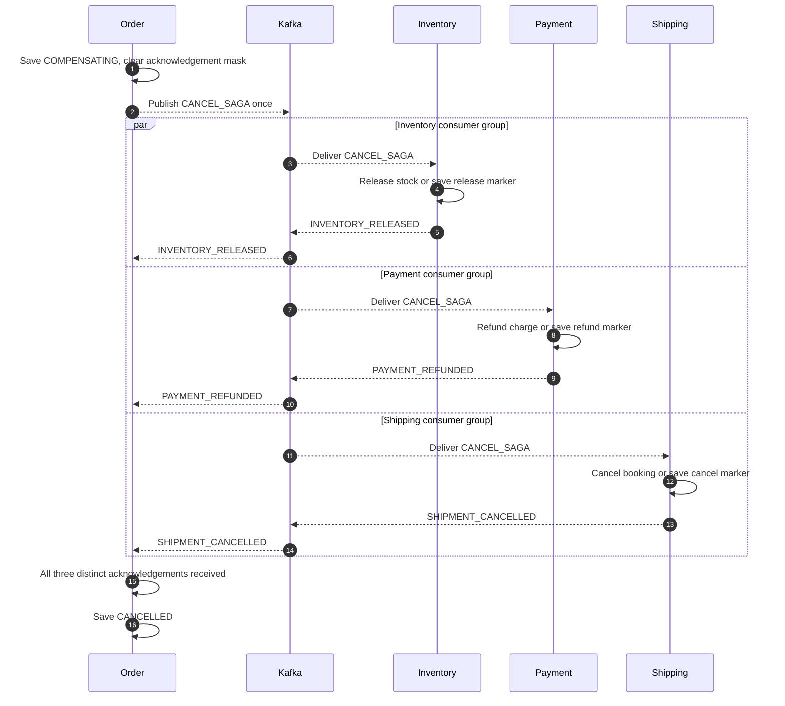

Acknowledgements can arrive in any order. Order stores one bit per participant:

| Acknowledgement | Bit | Example accumulated mask |
|---|---:|---:|
| PAYMENT_REFUNDED arrives first | 2 | 2 |
| INVENTORY_RELEASED arrives next | 1 | 3 |
| PAYMENT_REFUNDED repeats | 2 | Still 3 |
| SHIPMENT_CANCELLED arrives last | 4 | 7 — all three complete |

A duplicate refund event cannot masquerade as a stock-release acknowledgement.

## 7. Order states and the recovery boundary

### Orchestration state map

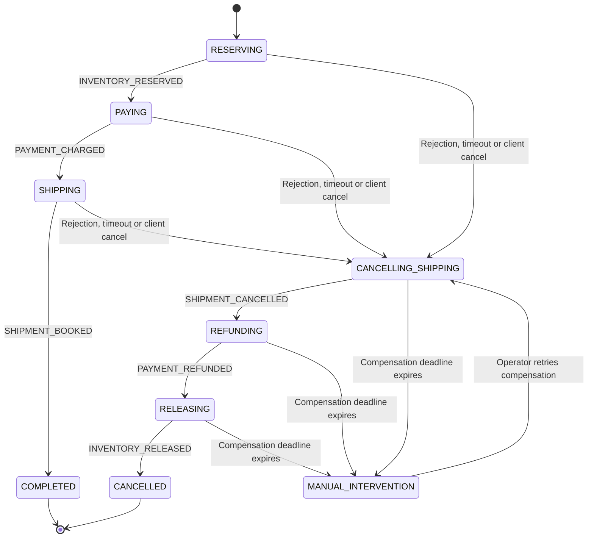

### Choreography state map

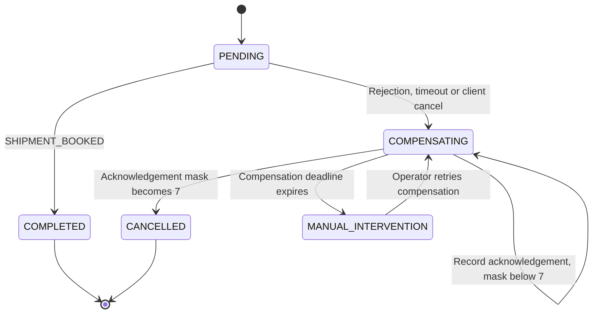

**COMPLETED and CANCELLED are terminal.** Late success cannot revive a cancelled
order. A completed checkout cannot be cancelled through this POC's cancellation API.

The state maps show timeout-driven intervention and retry. The API also allows an
operator to retry compensation while it is still in progress. Retrying restarts the
compensation sequence or broadcast; it never restarts charging or checkout.

The forward deadline starts when Order accepts the request. The compensation deadline
starts when cancellation begins or compensation is retried. Both default to 30 seconds
and live in PostgreSQL, so restarting Order does not erase them.

## 8. Inside one message delivery: why the databases stay consistent

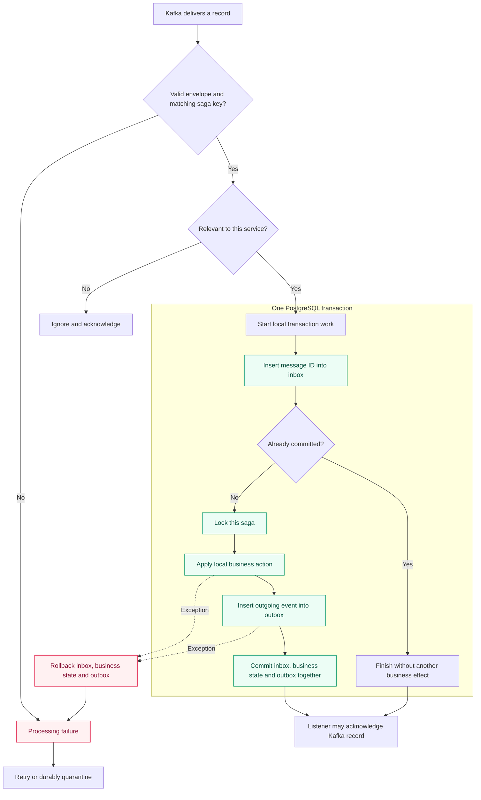

The diagram zooms in on local database work. In code, the dispatcher transaction
also encloses validation. An invalid or irrelevant record creates no business rows.

Three writes commit together:

1. **Inbox:** this message ID has been processed.
2. **Business state:** for example, stock is reserved.
3. **Outbox:** the resulting event must be delivered.

If processing fails, all three roll back. The same message can then retry.
Different message IDs for the same saga are serialized, and participant business
state prevents repeating a charge or reservation under a new message ID.

### The outbox crash window

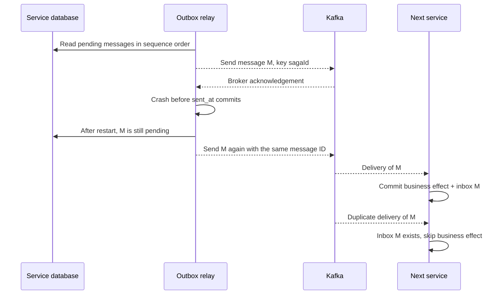

The deliveries may occur before or after the relay restarts; their relative timing
does not change the deduplication rule.

This is **at-least-once delivery with idempotent effects**. Kafka producer idempotence
alone cannot atomically commit a PostgreSQL transaction and a Kafka publish.

## 9. The dangerous race: refund arrives before charge

A timeout tells Order that the outcome is unknown. It does not prove Payment did
nothing. A delayed charge might still be waiting in Kafka.

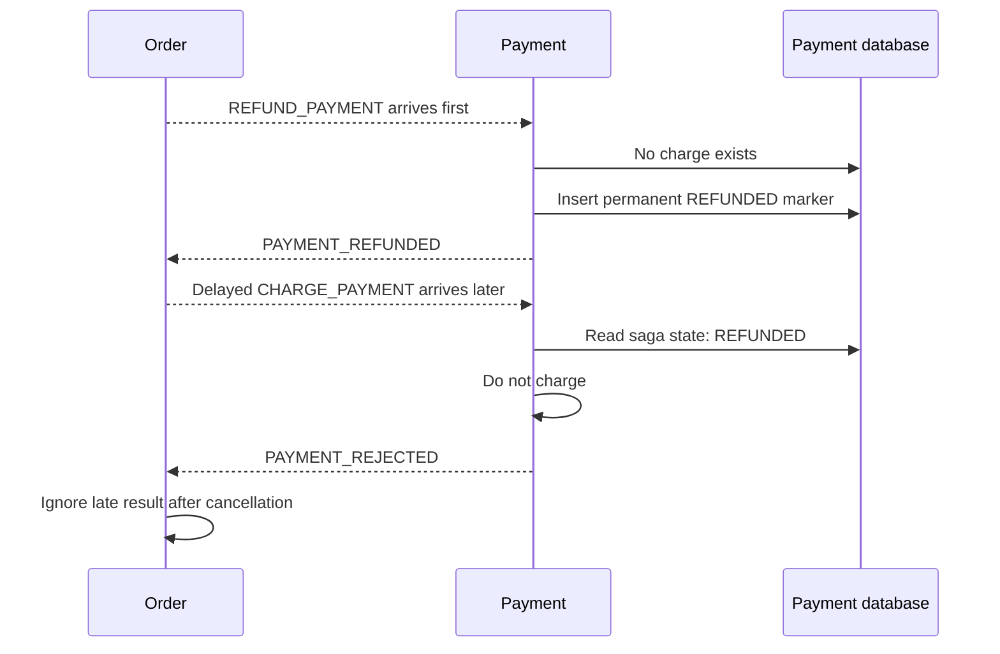

This is a **cancellation marker**, sometimes called a tombstone. The same rule applies
to released inventory and cancelled shipping.

| Incoming late forward work | Existing state | Effect |
|---|---|---|
| Reserve inventory | RELEASED | Do not reserve; publish rejection |
| Charge payment | REFUNDED | Do not charge; publish rejection |
| Book shipment | CANCELLED | Do not book; publish rejection |

In choreography, the late forward triggers are the corresponding prior-step events.
The same participant state checks protect both modes.

## 10. Failed refund: from retry to operator recovery

With `fault=REFUND_UNAVAILABLE`, Shipping rejects the booking after Payment charges,
and Payment's refund operation fails.

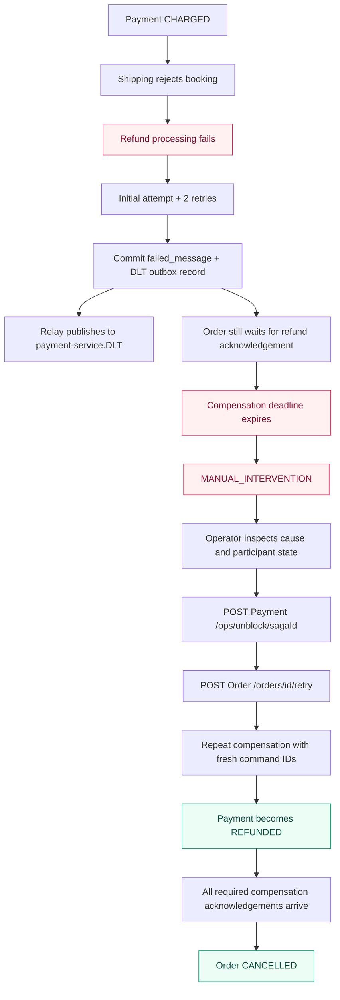

In orchestration, stock release waits behind the failed refund. In choreography,
stock may already be released while Payment still needs intervention.

The DLT receives its record asynchronously. It may arrive before or after Order's
deadline expires; quarantine in PostgreSQL is the durable record of the failure.

`/ops/unblock` is a demo-only way to make the simulated provider recover. A real
operator would fix the actual provider problem and reconcile its outcome first.

There are two distinct recovery actions:

| Action | What it repeats | Message identity |
|---|---|---|
| `POST /orders/{id}/retry` | Compensation protocol | Fresh command/event IDs |
| `POST /ops/replay/{failureId}` | One quarantined incoming record | Original message ID |

Replaying a failed record does not move an order out of `MANUAL_INTERVENTION`.
The order compensation retry explicitly reopens that recovery protocol.

## 11. Scenario outcomes at a glance

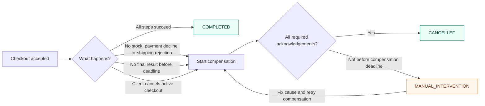

| Scenario | Final order outcome | Stock and payment |
|---|---|---|
| Successful checkout | COMPLETED | Stock allocated; payment charged |
| No stock / payment decline | CANCELLED | No net stock allocation or charge |
| Shipping rejection | CANCELLED | Reserved stock released; charge refunded |
| Transient Payment failure | Usually COMPLETED within deadline | One successful business effect |
| Payment unavailable past deadline | CANCELLED after successful compensation | No live charge or reservation |
| Refund remains unavailable | MANUAL_INTERVENTION | Refund unresolved; stock depends on saga mode |
| Provider repaired and compensation retried | CANCELLED | All compensation acknowledged |
| Broker outage / service restart | COMPLETED or compensated cancellation | Depends on deadline and recovery timing |

## 12. Watch these diagrams happen in the POC

From the project root:

```powershell
docker compose up -d --build --wait
node scripts/scenarios.mjs
node scripts/resilience.mjs
```

Run the two scripts sequentially. The resilience script intentionally stops and
restarts this project's services.

For one visually useful failure:

```powershell
$body = @{
  mode = 'ORCHESTRATION'
  sku = 'SKU-1'
  quantity = 1
  amountCents = 1200
  fault = 'SHIPPING_REJECTED'
} | ConvertTo-Json

$order = Invoke-RestMethod http://localhost:8080/orders -Method Post `
  -Headers @{'Idempotency-Key'=[guid]::NewGuid().ToString()} `
  -ContentType application/json -Body $body

Invoke-RestMethod "http://localhost:8080/orders/$($order.id)/history"
```

Wait for the order to settle and read its history again. Match the returned state
transitions to section 4. Repeat with `mode='CHOREOGRAPHY'` and compare with section 6.

### Where the diagrams live in code

| Concept | Implementation |
|---|---|
| Order transitions | [SagaLogic.java](../order-service/src/main/java/dev/saga/order/SagaLogic.java) |
| Persisted state, deadlines and retry | [OrderService.java](../order-service/src/main/java/dev/saga/order/OrderService.java) |
| Deadline scanning after restart | [OrderWatchdog.java](../order-service/src/main/java/dev/saga/order/OrderWatchdog.java) |
| Inbox and local transaction | [Dispatcher.java](../messaging/src/main/java/dev/saga/messaging/Dispatcher.java) |
| Reliable outgoing delivery | [OutboxRelay.java](../messaging/src/main/java/dev/saga/messaging/OutboxRelay.java) |
| Reservation / release | [InventoryHandler.java](../inventory-service/src/main/java/dev/saga/inventory/InventoryHandler.java) |
| Charge / refund | [PaymentHandler.java](../payment-service/src/main/java/dev/saga/payment/PaymentHandler.java) |
| Booking / cancellation | [ShippingHandler.java](../shipping-service/src/main/java/dev/saga/shipping/ShippingHandler.java) |

For operational commands and production boundaries, see the [detailed guide](GUIDE.md).
For executed test results, see the [verification record](VERIFICATION.md).
